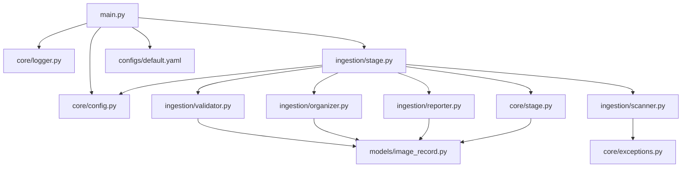
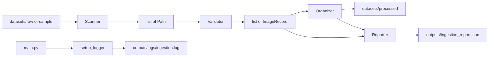

# Architecture

## Module Dependency Graph

Who imports whom in Sprint 1:

## Data Flow

How one ingestion run moves data:

## File Responsibilities

| File | Responsibility |
|------|----------------|
| `main.py` | CLI parsing, load config, setup logger, start stage |
| `core/config.py` | Load YAML into typed dataclasses |
| `core/logger.py` | Configure terminal + file logging |
| `core/stage.py` | Abstract stage interface |
| `core/exceptions.py` | Pipeline-specific errors |
| `models/image_record.py` | Shared image record model |
| `ingestion/scanner.py` | Find candidate image paths |
| `ingestion/validator.py` | Validate images and build records |
| `ingestion/organizer.py` | Copy/move to processed with stable IDs |
| `ingestion/reporter.py` | Build and export JSON report |
| `ingestion/stage.py` | Orchestrate the full ingestion pipeline |

## Design Notes

- Stages receive a `PipelineConfig` object; they do not load YAML themselves.
- Single-image failures become `status="invalid"` and do not crash the batch.
- Repeated ingestion of the same destination file becomes `status="skipped"`.
- Downstream modules should treat records with a non-null `processed_path` as usable.
