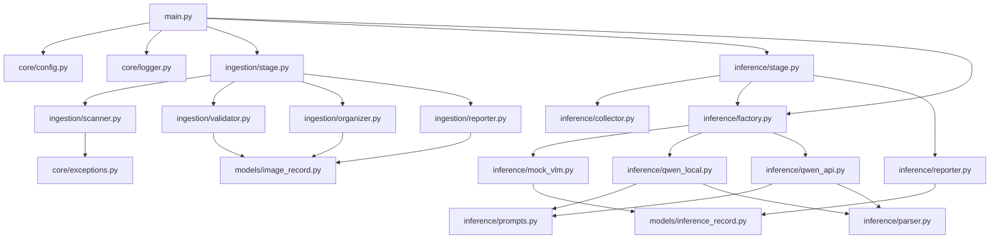
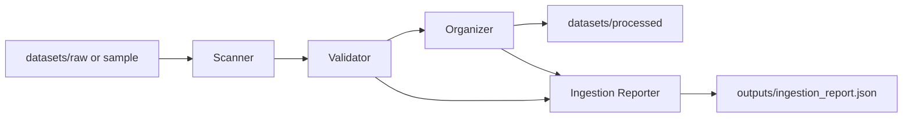
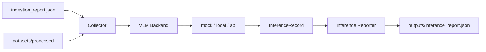

# Architecture

## Module Dependency Graph



## Data Flow

### Ingestion



### Inference



## Backend Notes

| Backend | model_name example | Needs |
|---------|--------------------|--------|
| mock | n/a | nothing |
| local | `Qwen/Qwen2.5-VL-3B-Instruct` | GPU + HF weights |
| api | `qwen-vl-plus` | `QWEN_API_KEY` + `api_base` |

CLI overrides YAML for one-off runs, for example:

```bash
python main.py infer --backend mock
python main.py infer --backend api
python main.py infer --backend local
```

Truncated or corrupt JPEGs may pass lightweight ingestion checks but fail during full pixel decode in local/API vision preprocessing.
