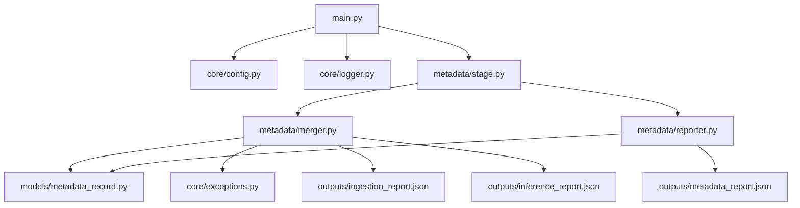
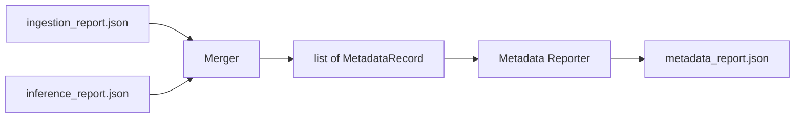

# Sprint 3 Architecture — Metadata Generation

## Goal

Merge Sprint 1 ingestion fields and Sprint 2 inference fields into one
metadata record per image, then export `outputs/metadata_report.json`.

## Module Dependency Graph



## Data Flow



## Status Rules

| status | Meaning |
|--------|---------|
| complete | Has processed image + inference success |
| partial | Has processed image + inference failed/skipped |
| ingestion_only | Has processed image + no inference row |
| failed | No usable processed_path |

## Scene Field

Sprint 3 uses a lightweight placeholder:

- `scene = first tag` when tags exist
- otherwise `null`

No extra VLM call is made in this sprint.

## CLI

```bash
python main.py metadata
python main.py metadata --ingestion-report outputs/ingestion_report.json --inference-report outputs/inference_report.json
```
