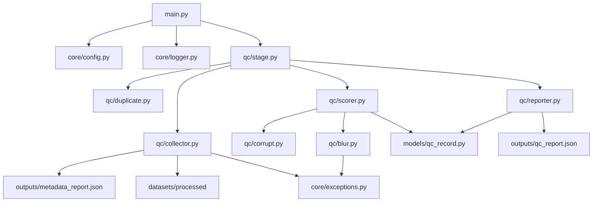
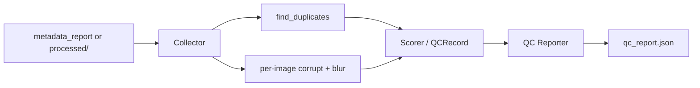

# Sprint 4 Architecture — Quality Control

## Goal

Mark images as `pass` / `warn` / `reject` using corrupt, blur, and
duplicate checks. Export `outputs/qc_report.json`. Do not delete files
by default (mark-only).

## Module Dependency Graph



## Data Flow



## Collection Strategy

1. If `metadata_report.json` exists, collect targets from it
   (`id` + `processed_path` + optional `checksum`).
2. Otherwise fall back to scanning `datasets/processed`
   (`image_id` = filename stem).

## Status Rules

| quality_status | When |
|----------------|------|
| reject | `is_corrupt` |
| warn | blurry and/or duplicate (not corrupt) |
| pass | none of the above |

Corrupt wins over blur/duplicate.

## Duplicate Strategy

- Group by SHA256 checksum (from metadata or computed on disk).
- Keep the first image id in each group; mark later ids as duplicates
  of the kept id (`duplicate_of`).
- Exact byte match only in this sprint (no perceptual hash yet).

## Blur Metric

- OpenCV Laplacian variance on grayscale decode.
- Higher score usually means sharper.
- `is_blurry` when `score < blur_threshold`.

## Config

```yaml
qc:
  blur_threshold: 100.0
```

CLI override:

```bash
python main.py qc --blur-threshold 50
```

Priority: CLI > YAML > dataclass default.

## CLI

```bash
python main.py qc
python main.py qc --processed datasets/processed --blur-threshold 100
python main.py qc --metadata-report outputs/metadata_report.json
```
