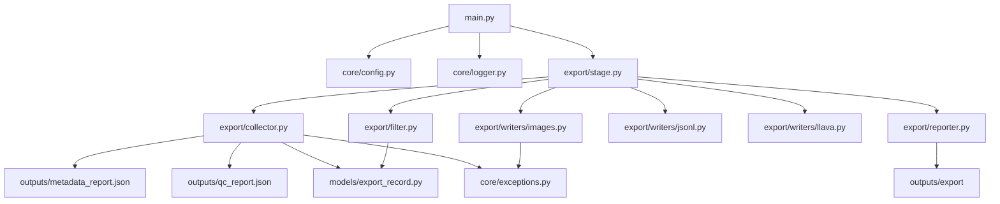
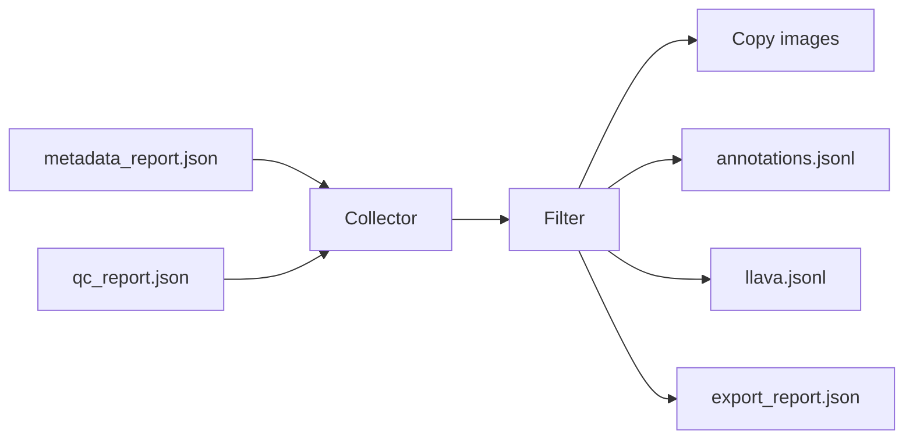

# Sprint 5 Architecture — Dataset Export

## Goal

Join metadata + QC into training candidates, apply platform filter policy,
and produce a **self-contained** export package under `outputs/export/`:

- `images/` — copied included images
- `annotations.jsonl` — flat training rows
- `llava.jsonl` — LLaVA-style conversations
- `export_report.json` — full audit trail (included + excluded)

## Module Dependency Graph



## Data Flow



## Filter Policy

| Rule | Default |
|------|---------|
| Exclude duplicates (`is_duplicate`) | true |
| Include blurry (`is_blurry`) | false |
| Require non-empty caption | true |
| Exclude corrupt / reject / failed / missing file | always |

Filtering uses fine-grained QC flags (`is_duplicate`, `is_blurry`, `is_corrupt`),
not only the coarse `quality_status == warn` label.

Excluded rows stay in `export_report.json` with `exclude_reason` for auditing.
Only included rows are copied into `images/` and written to annotation JSONL files.

## Annotation Formats

### Flat JSONL (`annotations.jsonl`)

```json
{"id":"...","image":"images/....jpg","caption":"...","tags":[],"objects":[],"scene":"..."}
```

### LLaVA conversations (`llava.jsonl`)

```json
{
  "id": "...",
  "image": "images/....jpg",
  "conversations": [
    {"from": "human", "value": "<image>\nDescribe this image in detail."},
    {"from": "gpt", "value": "..."}
  ]
}
```

## Config

```yaml
export:
  export_dir: outputs/export
  exclude_duplicates: true
  include_blurry: false
  require_caption: true
```

Images are always copied into the export package (platform delivery requirement).

Priority: CLI > YAML > dataclass defaults.

## CLI

```bash
python main.py export
python main.py export --include-blurry
python main.py export --no-require-caption
python main.py export --export-dir outputs/export_demo
```
