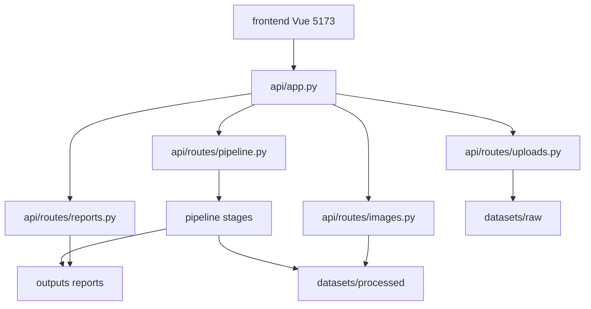
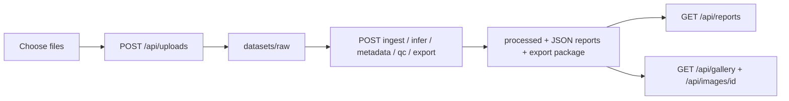

# Sprint 6 Architecture — Web API and Vue UI

## Goal

Expose the existing CLI pipeline over HTTP and provide a minimal Vue 3
console so a user can upload raw images, run all five stages, and inspect
reports / gallery in the browser.

Business logic stays in `pipeline/*`. The API is a thin wrapper. The UI
only calls HTTP endpoints.

Sprint 6 does **not** include drag-and-drop polish, a dedicated Export
page, auth, or SQL. Sprint 7 covers the frontend polish; see
[S7_architecture.md](S7_architecture.md).

## Module Dependency Graph



## Data Flow



## HTTP API

| Method | Path | Role |
|--------|------|------|
| GET | `/api/health` | Liveness |
| GET | `/api/reports` | Per-stage summary (missing = available false) |
| GET | `/api/reports/{stage}` | Full report JSON |
| GET | `/api/gallery` | Metadata + QC cards |
| GET | `/api/images/{image_id}` | Processed image bytes |
| GET | `/api/uploads` | List `datasets/raw` |
| POST | `/api/uploads` | Images and/or `.zip` into raw (50 MB / file) |
| GET | `/api/pipeline/stages` | List runnable stages |
| POST | `/api/pipeline/ingest` | `IngestionStage` on `raw_dir` |
| POST | `/api/pipeline/infer` | Default backend `mock` |
| POST | `/api/pipeline/metadata` | Merge reports |
| POST | `/api/pipeline/qc` | Quality control |
| POST | `/api/pipeline/export` | Self-contained export package |

Pipeline POSTs are **synchronous**: the HTTP request waits until the
stage finishes.

CORS allows `http://localhost:5173` and `http://127.0.0.1:5173`.
`api/app.py` sets cwd to the repo root so relative dataset paths resolve.

## Frontend

Vite + Vue 3 under `frontend/`:

- `Pipeline` — file input + five Run buttons
- `Dashboard` — report summaries
- `Gallery` — thumbnails via `/api/images/{id}`

API base URL: `frontend/.env` → `VITE_API_BASE` (default `http://127.0.0.1:8000`).

## Run locally

Two processes:

```bash
# terminal 1 — repo root
uvicorn api.app:app --reload --port 8000

# terminal 2
cd frontend
npm install
npm run dev
```

Open the Vite URL (usually `http://localhost:5173`). Keep infer on
`mock` unless an API key is set.