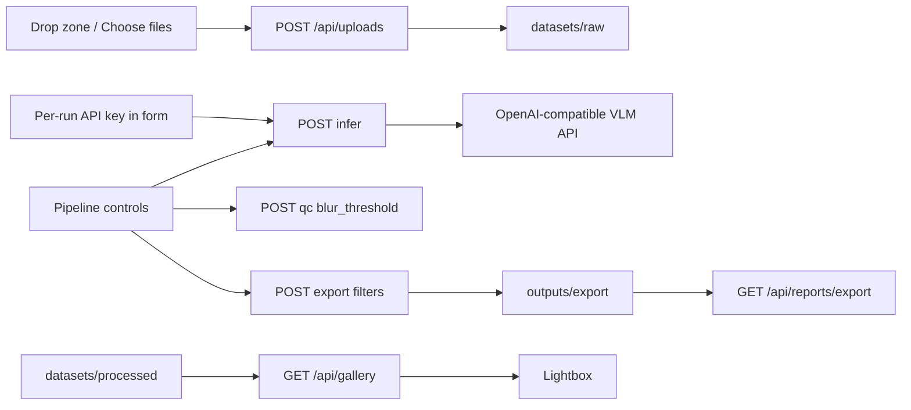

# Sprint 7 Architecture — Frontend polish

## Goal

Keep the Sprint 6 FastAPI wrapper and Vue console. Improve layout and
operator controls so a user can upload with drag-and-drop, tune QC /
export without editing YAML for every run, inspect gallery images in a
modal, and read the last export package on its own tab.

Business logic still lives in `pipeline/*`. API keys are **per-request
user parameters**: they are not YAML defaults and are not written to
reports.

## What changed

### Backend (small)

| Method | Path | Change |
|--------|------|--------|
| GET | `/api/pipeline/defaults` | Public YAML defaults for the UI (no secrets) |
| POST | `/api/pipeline/qc` | Optional JSON `{ "blur_threshold": 100 }` |
| POST | `/api/pipeline/infer` | `{ "backend", "api_key"? }` |
| POST | `/api/pipeline/export` | Already accepted the three filter flags |

`blur_threshold` `null` (or omitted) uses `configs/default.yaml`.
A higher Laplacian cutoff marks **more** images as blurry
(`score < threshold`).

For `backend=api`, `api_key` is a **this-call** override. The server
uses it to call the configured OpenAI-compatible endpoint, then drops
it. It is never copied into YAML, `inference_report.json`, or log lines
(errors that contain the secret are redacted). Empty/omitted `api_key`
still falls back to `VLM_API_KEY` (see `inference.api_key_env`) so the
CLI keeps working.

The UI requires a pasted key when Infer is set to `api` (no silent
env default in the browser). Response field `api_key_from` is
`request` / `env` / `null` — never the key itself.

### Frontend

Vite + Vue 3 tabs:

- **Pipeline** — drop zone + Choose files; infer backend; password
  field for a per-run API key; QC number; export checkboxes; five run
  buttons that skip when options are unchanged (Alt-click to force)
- **Dashboard** — report summaries + refresh
- **Gallery** — QC color badges, refresh, click thumbnail → modal
- **Export** — last `export_report.json` summary / policy / artifact paths

Global CSS replaces the Vite starter stylesheet (app bar, cards, tabs).
Tabs use `v-show` so a typed key stays in memory while you switch pages
(still not written to disk).

## Data flow

## Operator notes

- Infer default in the UI remains **mock**.
- Stage buttons stay independent (each writes its own report). Recommended
  order is 1→5; out-of-order usually 400s rather than corrupting data.
- A successful run is skipped on later clicks until upload / backend /
  key / QC / export options change. Alt-click forces a re-run.
- For `api` from the page: paste **your** key, use a vision / multimodal
  model, not a text-only chat model.
- There is still no login: whoever can open the local console can paste
  a key for that infer call. Multi-user auth is later.
- Export tab does not list every exported filename; it shows the report
  the pipeline already writes.

## Out of scope (still)

SQL, auth, drag-drop libraries, Element Plus / Tailwind, rewriting
pipeline stages.
